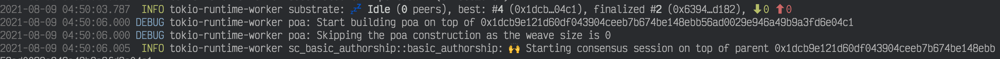
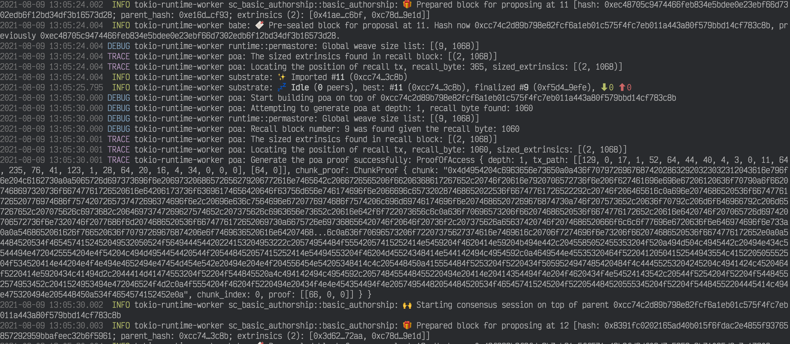
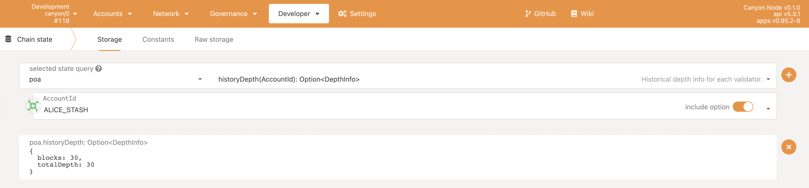
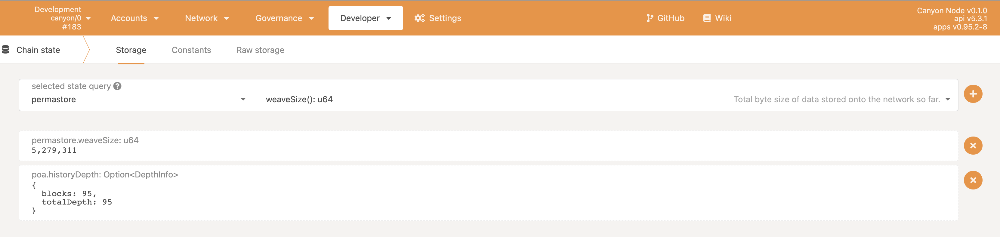
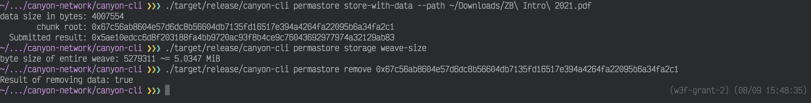
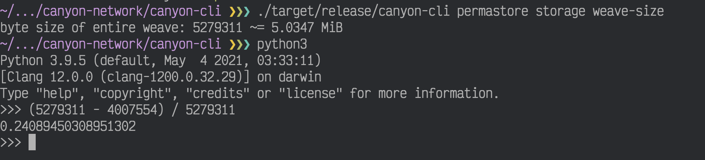
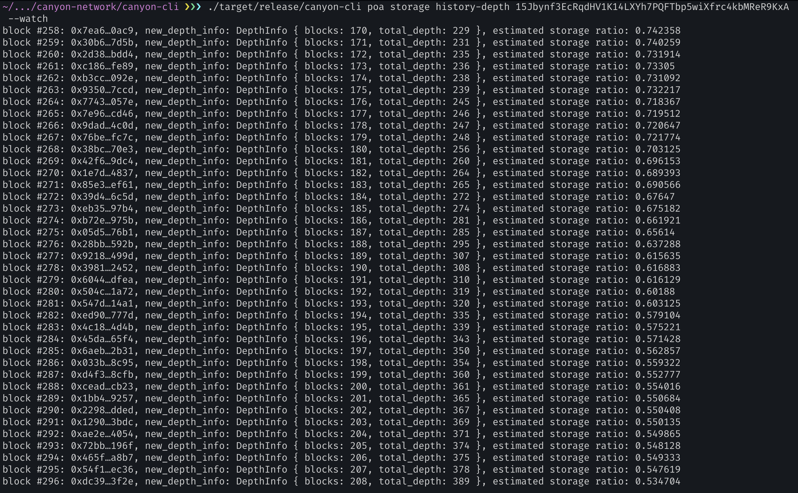

# Testing guide

<!-- TOC GFM -->

* [Unit tests](#unit-tests)
* [Test the PoA consensus](#test-the-poa-consensus)
    * [Build and run the dev chain](#build-and-run-the-dev-chain)
        * [Using Docker](#using-docker)
        * [Compile from the source locally](#compile-from-the-source-locally)
    * [Store the data](#store-the-data)
        * [canyon-cli](#canyon-cli)
    * [Inspect the state](#inspect-the-state)
    * [Sync the chain](#sync-the-chain)

<!-- /TOC -->

This document contains a guide for testing the deliverables in the scope of [Phrase 2 of canyon network grant](https://github.com/w3f/Grants-Program/pull/488).

## Unit tests

The tests are either put into a seperate file `tests.rs` or included as an internal private module `tests` in the source file. So we could just go to the directory of each crate and run `cargo test`.

- [cc-rpc](./client/rpc/)
- [cc-datastore](./client/datastore)
- [cc-consensus-poa](./client/consensus/poa)
- [pallet-poa](./pallets/poa)

## Test the PoA consensus

### Build and run the dev chain

#### Using Docker

The docker image is hosted on https://hub.docker.com/r/canyonlabs/canyon .

```bash
$ docker pull canyonlabs/canyon:w3f-grant-2
```

```bash
# Prepare a local directory for the chain data
$ sudo rm -rf data
$ mkdir data

# Make sure we won't have the permission error.
$ chown 1000.1000 $(pwd)/data -R

# Run the docker in the background, remember to mount the local directory we just created.
$ docker run -d -it --name canyon -p 9933:9933 -p 9944:9944 -p 30333:30333 -v $(pwd)/data:/canyon canyonlabs/canyon:w3f-grant-2 canyon --dev -d /canyon --log=info,runtime=debug,poa=trace,rpc::permastore=debug

# Show the logs
$ docker logs -f canyon
```

#### Compile from the source locally

```bash
$ git clone https://github.com/canyon-network/canyon --branch w3f-grant-2
$ cargo build --release
```

Start the dev chain with a fresh db and enable the related log:

```bash
$ rm -rf d && ./target/release/canyon --dev -d d --log=info,runtime=debug,poa=trace,rpc::permastore=debug
```

### Store the data

#### canyon-cli

Compile the CLI binary:

```bash
$ git clone https://github.com/canyon-network/canyon-cli --branch w3f-grant-2
$ cargo build --release
```

You can also download the prebuilt binary of canyon-cli from https://github.com/canyon-network/canyon-cli/releases/tag/release-w3f-grant-2 .

Check out the help of `permastore` command:

```bash
$ ./target/release/canyon-cli permastore --help
canyon-cli-permastore 0.1.0
Permastore

USAGE:
    canyon-cli permastore <SUBCOMMAND>

FLAGS:
    -h, --help       Prints help information
    -V, --version    Prints version information

SUBCOMMANDS:
    help               Prints this message or the help of the given subcommand(s)
    remove             Remove data
    store              Submit the `store` extrinsic only
    store-with-data    Submit the `store` extrinsic and the transaction data
    submit             Submit the transction data only
```

Now we only support storing the small files(<= 10MiB), so we could just use `store-with-data`:

```bash
# Pass the data directory using `--data`
$ ./target/release/canyon-cli permastore store-with-data --data "web3 foundation"
data size in bytes: 15
        chunk root: 0xf9b321d3edaae871bbda8918480e18ca4b5c5c7fe1b8a77c84d78bf42939486e
  Submitted result: 0x31226eda234c2584841fdf24744d688415e6fa3bc0092a701e59c2fba89a9fe4

# Pass the data file using `--path`
$ ./target/release/canyon-cli permastore store-with-data --path LICENSE
data size in bytes: 1068
        chunk root: 0xdd3236327d0c4cceab6aaf5b72e9c54feb4362ec8c37d98330da59c99bce5a51
  Submitted result: 0xa7da9af10def640d37b3888f53bca4d9e29156a3b21fc4298b407953a2735d87
```

### Inspect the state

Empty weave:



After we stored some data:



In order to work with [polkadot.js.org](https://polkadot.js.org/apps/?rpc=ws%3A%2F%2F127.0.0.1%3A9944#/explorer), we need to inject the [Canyon types](https://github.com/canyon-network/canyon/blob/w3f-grant-2/scripts/types.json), then we can take a look at the storage ratio of dev validator `Alice` from the UI:



Since the node has 100% of the data, the storage ratio is 100%(`30 / 30 = 1`).

The byte size of whole network storage can be seen from `permastore>weaveSize`:



Now we try removing some data from the node to mock a validator doesn't own the entire weave, the estimated storage ratio by `historyDepth` should reveal the real value if the network produces enough blocks.

When removing the data, it's better to keep a note of chunk root of the source file you store, then we can directly copy the line of chunk root to the `remove` command:



If the chunk root of file you stored previously can not be found, you can use the option `--dry-run` of `store-with-data` to get the chunk root.

In this case, we delete the data of a file that has 4007554 bytes, since the size of total network storage is 5279311, hense the storage ratio of `Alice` should be actually **0.24**.



Now we can watch the change of `historyDepth` using CLI:

```bash
# Alice stash is 15Jbynf3EcRqdHV1K14LXYh7PQFTbp5wiXfrc4kbMReR9KxA
$ ./target/release/canyon-cli poa storage history-depth 15Jbynf3EcRqdHV1K14LXYh7PQFTbp5wiXfrc4kbMReR9KxA  --watch
```

We can see the storage ratio of `Alice` is basically decreasing steadily:



Some key points:

```
block #268: 0x38bc…70e3, new_depth_info: DepthInfo { blocks: 180, total_depth: 256 }, estimated storage ratio: 0.703125
block #280: 0x504c…1a72, new_depth_info: DepthInfo { blocks: 192, total_depth: 319 }, estimated storage ratio: 0.60188
block #300: 0x3e08…4364, new_depth_info: DepthInfo { blocks: 212, total_depth: 418 }, estimated storage ratio: 0.507177
block #351: 0x82bd…95a4, new_depth_info: DepthInfo { blocks: 263, total_depth: 645 }, estimated storage ratio: 0.407751
block #515: 0xd4ff…f484, new_depth_info: DepthInfo { blocks: 427, total_depth: 1385 }, estimated storage ratio: 0.308303
block #807: 0x02b8…7d19, new_depth_info: DepthInfo { blocks: 719, total_depth: 2564 }, estimated storage ratio: 0.280421
```

### Sync the chain
